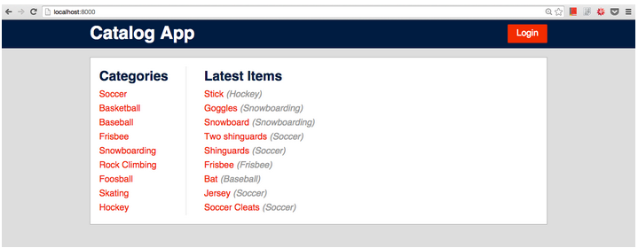
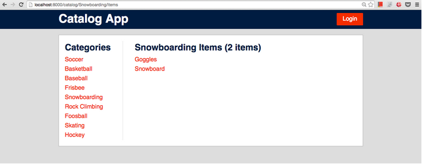
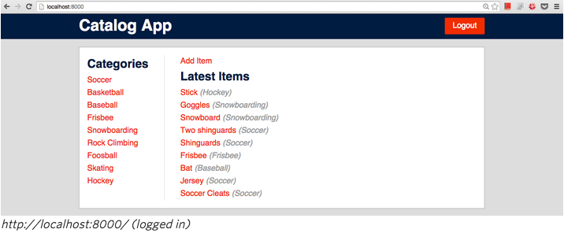
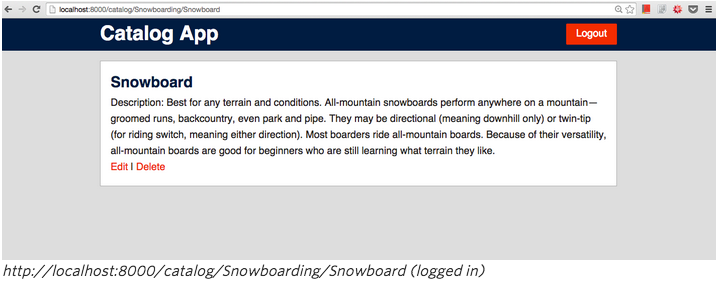
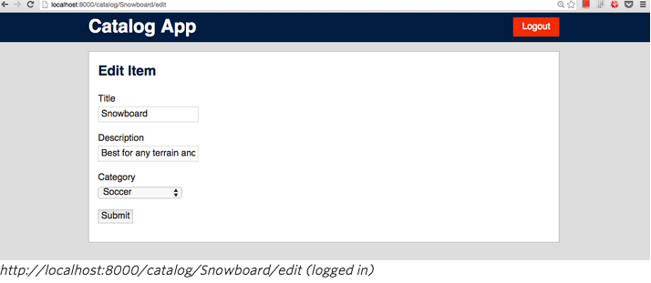
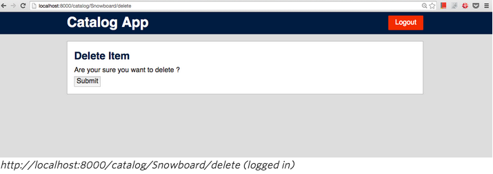
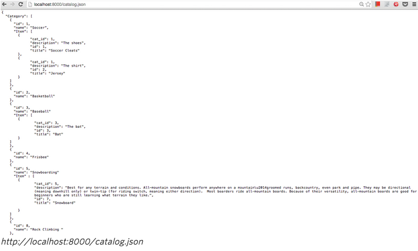

# Item Catalog: Getting Started

## Project Description

In this project, you will be developing a web application that provides a list of items within a variety of categories and integrate third party user registration and authentication. Authenticated users should have the ability to post, edit, and delete their own items.

You will be creating this project essentially from scratch, no templates have been provided for you. This means that you have free reign over the HTML, the CSS, and the files that include the application itself utilizing Flask.

## Project Display Example
Note: The screenshots on this page are just examples of one implementation of the minimal functionality. You are encouraged to redesign and strive for even better solutions.

In this sample project, the homepage displays all current categories with the latest added items.

        

Selecting a specific category shows you all the items available for that category.

Selecting a specific item shows you specific information about that item.

After logging in, a user has the ability to add, update, or delete item information. Users should be able to modify only those items that they themselves have created.

Note that the link is ‘http://localhost:8000/catalog/Snowboarding/Snowboard’. This is to ensure ease of readability.

The application should provide a JSON endpoint at the very least.

# Getting Started

Before we begin coding, there are several steps that you should take to make sure that you have everything downloaded in order to run your future web application.

- Install Vagrant and VirtualBox if you have not done so already. Instructions on how to do so can be found on the websites as well as in the course materials..
- Clone this repository. There is a catalog folder provided for you, but no files have been included. If a catalog folder does not exist, simply create your own inside of the vagrant folder.
Launch the Vagrant VM (by typing `vagrant up` in the directory fullstack/vagrant from the terminal).
- Write the Flask application locally in the /vagrant/catalog directory (which will automatically be synced to /vagrant/catalog within the VM). Name it application.py.
- Run your application within the VM by typing python /vagrant/catalog/application.py into the Terminal. If you named the file from step 4 as something other than application.py, in the above command substitute in the file name on your computer.
- Access and test your application by visiting http://localhost:8000 locally on your browser.

Now that we’ve set up the directories and downloaded the software, some of you may be wondering, what do I do now? Do I start with the front end? Do I start with application.py? Do I make my database? Now might be a good time to revisit Lesson 4 of Full Stack Foundations, these issues are covered.

Whether you start on the front end or the back end is up to you. Some people prefer seeing the layout before thinking about the data they want to present, whereas others enjoy thinking about the structure and organization of their data and the Flask application before beginning on the front end portion of their project.

There are four parts that you will need to complete:

- the HTML (structure of the pages)
- the CSS (the style of the pages)
- the Flask Application (to put it online)
- it must include authentication/authorization to allow users to login before making changes
the database (to store and organize the information)

As long as you hit these four parts, it doesn’t matter where you begin, whether you begin with the HTML/CSS or Flask and the database. If you’re looking for a little bit more guidance, this is what Lorenzo, the Full Stack Foundations instructor had to say:

        “Personally, I usually start with the database layout so that the database is modelling the information the way I want. Then I go ahead and add the backend, the Flask code, the Python code, and then I move on to the frontend where I then receive feedback on the frontend where I use the feedback to make it more stylish and elegant and presentable with everything else already in place. This is just me though, it varies from developer to developer.”

# To Submit

Once you have finished your project, please create a pull request and mark me as a reviewer
